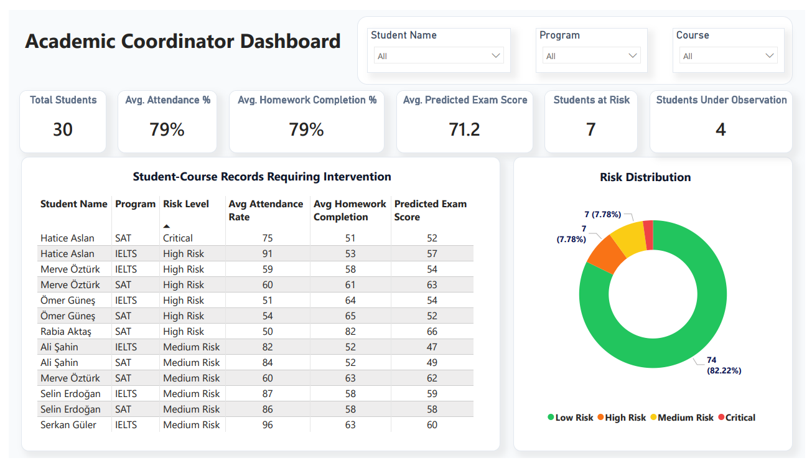
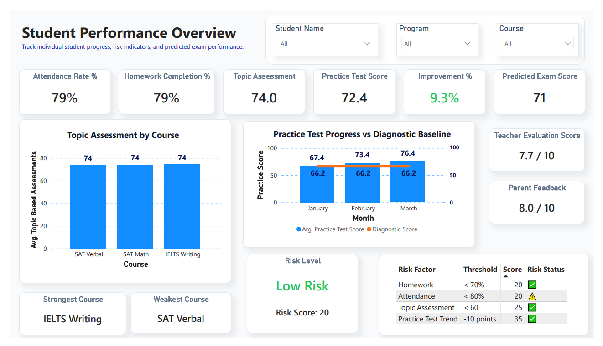
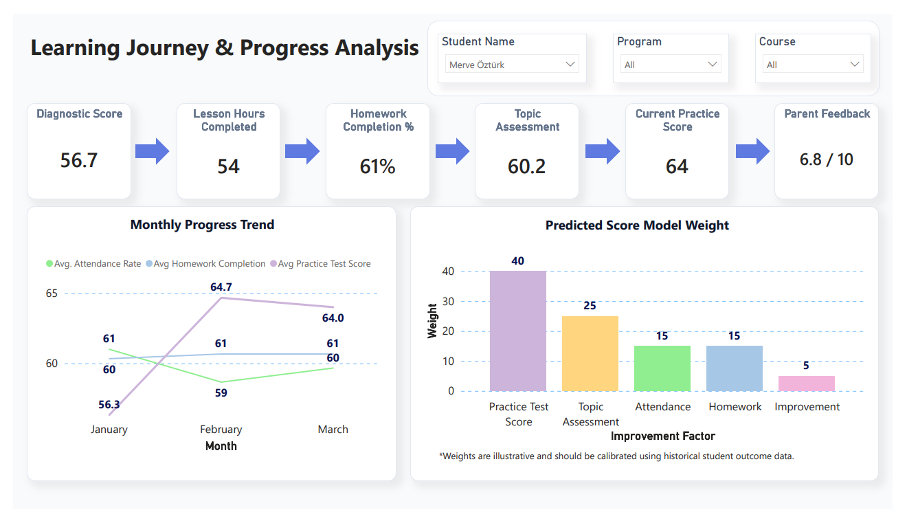

# Student Performance Analytics Dashboard

## Project Overview
This project is a comprehensive student analytics solution developed in Power BI to help educational institutions monitor student performance, identify at-risk students, and support data-driven decision making.
The dashboard integrates attendance records, homework completion, topic mastery, and practice exam results to provide a holistic view of student progress.

## Objectives
- Monitor student academic performance
- Identify at-risk students
- Track attendance and homework completion
- Analyze exam performance trends
- Predict future exam outcomes
- Support intervention planning

## Key Features
### Student Performance Tracking
- Attendance monitoring
- Homework completion analysis
- Topic mastery evaluation
- Practice exam trend analysis

### Risk Assessment Model
Students are classified based on:
- Attendance Rate
- Homework Completion Rate
- Topic Mastery Score
- Practice Test Performance Change

Risk Categories:
- Low Risk
- Medium Risk
- High Risk
- Critical Risk

| Metric | Threshold | Risk Points |
|----------|----------|----------|
| Attendance | < 80% | 20 |
| Homework Completion | < 70% | 20 |
| Topic Assessment | < 60% | 25 |
| Practice Test Change | -10 points vs previous month | 35 |

| Risk Level | Score Range | Recommended Action |
|------------|------------|------------|
| Low Risk | 0-25 | Routine monitoring |
| Medium Risk | 26-50 | Teacher follow-up |
| High Risk | 51-75 | Academic coordinator intervention |
| Critical | 76-100 | Parent meeting and personalized action plan |

### Predictive Exam Score
A weighted scoring model estimates future exam performance using:
| Metric              | Weight |
| ------------------- | ------ |
| Practice Test Score | 40%    |
| Topic Mastery       | 25%    |
| Attendance          | 15%    |
| Homework Completion | 15%    |
| Improvement Trend   | 5%     |

## Dashboard Pages
### Academic Coordinator Overview
Provides a high-level summary of:
- Total Students
- Average Attendance, Homework Completion, Predicted Exam Score
- Students Under Observation
- Student at Risk
- Overall Risk Distribution

### Student Performance Overview
Includes:
- Performance Trends
- Attendance Analysis
- Homework Analysis
- Improvement
- Topic Assessment and Practice Test Score Analysis
- Risk Segmentation
- Predicted Exam Score

### Learning Journey & Progress Analysis
Focuses on:
- Monthly Progress Trend
- Predicted Score Model Weight

## Tools Used
- Power BI
- DAX
- Power Query
- Excel

## Dataset
The dataset was created for educational analytics portfolio purposes and contains:
- Student demographics
- Attendance records
- Homework completion rates
- Topic assessment scores
- Practice exam results
- Exam performance metrics

**In this study, data standardization was applied to enable comparison of data from different programs and exam types.

## Dashboard Page

### Academic Coordinator Overview

### Student Performance Overview

### Learning Journey Progress Analysis

